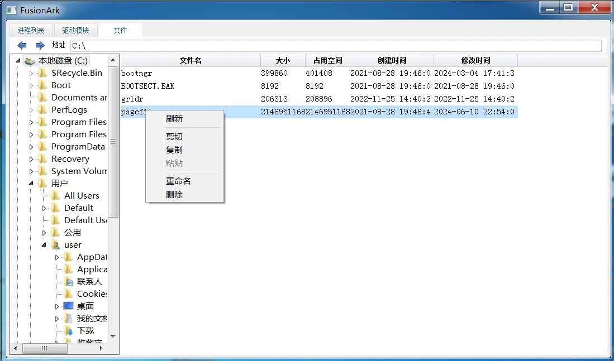

Windows内核工具，参考众多开源项目和技术文章融合而成，故命名为FusionArk。
# 功能介绍
进程管理：实现了进程信息查看，进程句柄，进程模块，进程内存等。

驱动模块信息查看

文件管理：实现了对文件的复制，删除，重命名

# 项目实现细节
## 进程遍历思路：
通过ZwQuerySystemInformation，查询SystemProcessInformation，然后通过PsLookupProcessByProcessId函数获取EPRCESS对象，然后信息解析。（SystemProcessInformation最终通过r0遍历Eprocess链表获取的进程）
## 句柄枚举思路：
通过ZwQuerySystemInformation，查询SystemHandleInformation，筛选出指定pid的数据。然后直接挂靠到目标进程，调用ZwQueryObject查询句柄信息
## 内存遍历思路：
通过驱动调用ObOpenObjectByPointer打开进程句柄，返回到ring3，再通过VirtualQueryEx枚举内存数据
## 强行关闭进程思路：
内核层先获取EProcess对象，再通过ObOpenObjectByPointer获取句柄，然后再调用ZwTerminateProcess关闭
## 内核模块遍历思路：
通过AuxKlibQueryModuleInformation获取所有内核模块的信息，然后再通过ZwOpenDirectoryObject，ZwQueryDirectoryObject获取Driver目录和FileSystem目录的驱动信息，二者通过内核模块的基址关联
## 文件管理思路：
### 打开或新建文件：
通过IoCreateFile打开对应路径的根目录，得到根目录的FileObject，从Vpb->DeviceObject中获取到卷设备，然后构造IRP发送IRP_MJ_CREATE到卷设备，返回打开文件的FileObject。
### 关闭文件句柄：
将构造irp，分别发送IRP_MJ_CLEANUP和IRP_MJ_CLOSE到卷设备。
### 读写文件：
发送IRP_MJ_READ 或 IRP_MJ_WRITE到卷设备
### 设置文件属性：
主功能号：IRP_MJ_SET_INFORMATION。 pIrpSp->Parameters.QueryFile.FileInformationClass指定FILE_INFORMATION_CLASS中的一个
### 查询文件属性：
主功能号：IRP_MJ_QUERY_INFORMATION。pIrpSp->Parameters.QueryFile.FileInformationClass指定FILE_INFORMATION_CLASS中的一个
### 目录查询：
主功能号IRP_MJ_DIRECTORY_CONTROL，副功能号IRP_MN_QUERY_DIRECTORY。pIrpSp->Parameters.QueryDirectory.FileInformationClass指定FILE_INFORMATION_CLASS中的一个。
通过pIrpSp->Flags 是否包含 SL_RESTART_SCAN，指定首次查询还是继续查询。
### 强删文件：
打开文件，设置FileDispositionInformation属性（关闭时删除），然后发送IRP_MJ_CLEANUP和IRP_MJ_CLOSE关闭文件。
### 重命名：
打开文件，设置FileRenameInformation，然后发送IRP_MJ_CLEANUP和IRP_MJ_CLOSE关闭文件。
### 复制文件：
打开原文件和目标文件，将原文件内容写入目标文件。
# 注意事项
1. 该项目只支持win7以上的x64系统。
2. 驱动运行依赖内核pdb文件，需要先运行PDBDownloader下载内核pdb文件
# 参考
<https://github.com/BlackINT3/OpenArk> 

<https://github.com/PKRoma/ProcessHacker> 

<https://bbs.kanxue.com/thread-264070.htm> 

